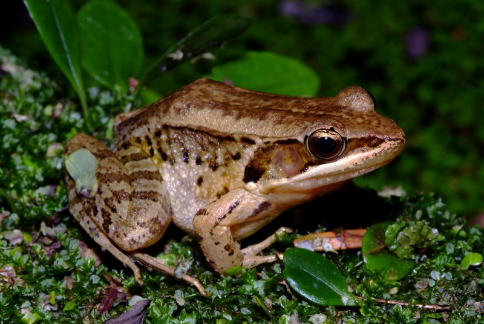
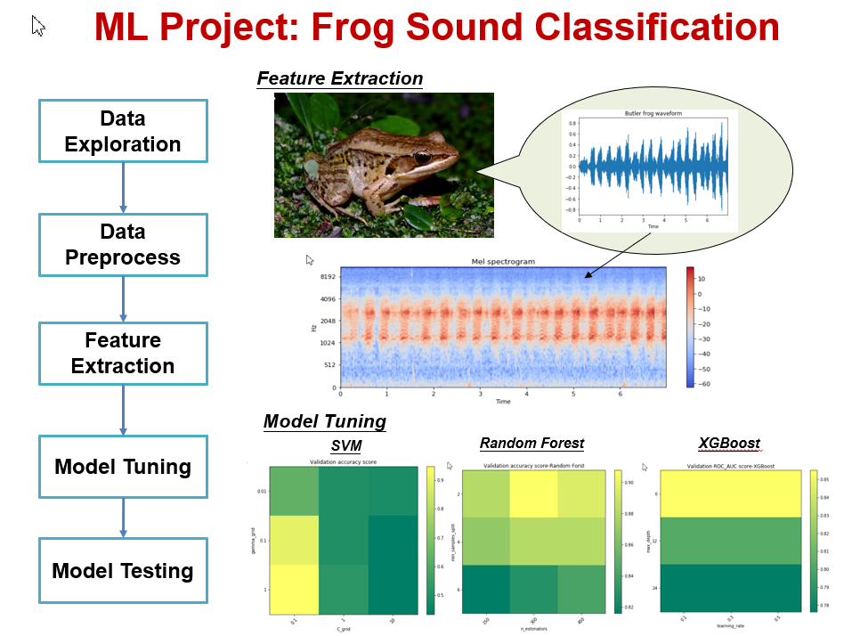
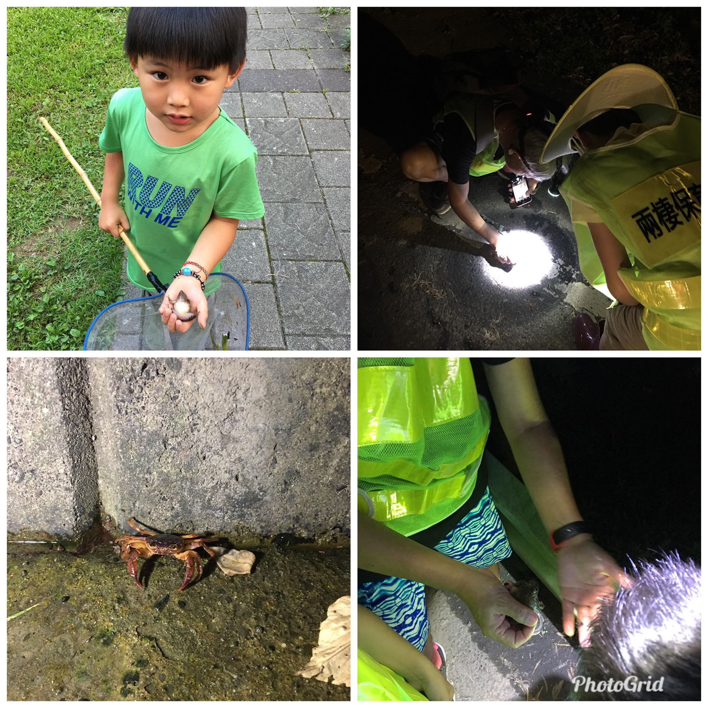

# Taiwan's Frog Sounds Classification

Frogs in Taiwan can be sorted into 5 families according to their physical appearance and skeleton structure. Both the cute tree frog family and the ugly toad family are members of the frog clan. One single frog species can have a kaleidoscope of colors and skin patterns. Their mating calls are even more variable, including pleasant sounds like croaking, birds and insects chirping, dogs barking, turkeys quacking or musical harping. A night walk into the world of frogs will bring you wonderful surprises.
 
There are over 4000 species of frogs in the world, mostly in the tropics and the subtropical areas. Of the 32 species found in Taiwan, 8 are endemic species that include, with the exception of Bufo bankorensis, 7 of the cute-looking family Rhacophoridae (tree frog). Though not many in number of species, the total population is great and entitles Taiwan the “frogs’ paradise”. Taiwan is privileged with the humid and rainy habitats favorable for frogs, and the profuse rain providing the frogs a long reproduction stage makes Taiwan one of the best places for frog-watching. 
 
In this study, we try to use MFCC (Mel-Frequency Cepstrum) to extract the feature of flog sound. Then we use 4 supervised leaning (SVD/RF/XGBoost/LightGBM) to train the model for flog sound classificatioin. The trainng and testing accuracy as below.

## Result
| Model | Initial Model  | Model turning | Testing |
| :--: | :--: | :--: | :--: |
| SVM | 0.8 | 0.94 | 0.99 |
| Random Forst | 0.6 | 0.90 | 0.95 |
| XGBoost | 0.75 | 0.85 | 0.75 |
| LightGBM | 0.85 | 0.85 | 0.85 |

## Reference
http://www.froghome.idv.tw/html/class_6/website.html

http://wagner.zo.ntu.edu.tw/multi-database/amph/index.htm

